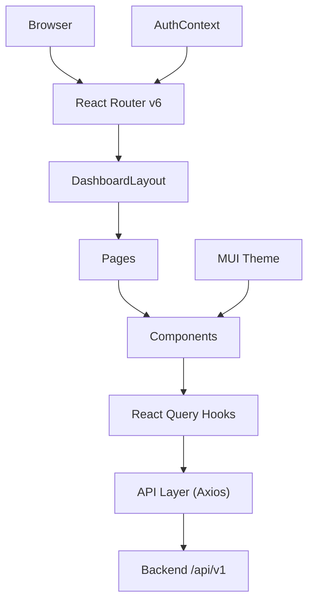
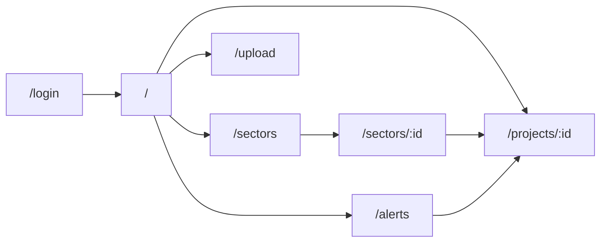

# PAIMANA Frontend — Codebase Walkthrough

## Overview

A complete React 18 + TypeScript frontend for the **PAIMANA Project Delay-Prediction Platform**. The codebase is ready to install and run — 52 files across a clean, layered architecture.

> [!TIP]
> **To get started**, set this as your workspace and run:
> ```bash
> cd /Users/krishnapriyashivkumarbarhalikar/.gemini/antigravity/scratch/paimana-frontend
> npm install
> npm run dev
> ```

---

## Architecture



### Layer Responsibilities

| Layer | Directory | Purpose |
|---|---|---|
| **Config** | root | Vite, TypeScript, package.json |
| **Types** | `src/types/` | Shared TypeScript interfaces for projects, predictions, alerts, auth |
| **API** | `src/api/` | Axios client + endpoint functions per domain |
| **Hooks** | `src/hooks/` | TanStack React Query wrappers for caching/fetching |
| **Context** | `src/context/` | Auth state (JWT + localStorage, demo fallback) |
| **Components** | `src/components/` | Reusable UI: charts, cards, tables, badges, upload zone |
| **Pages** | `src/pages/` | Route-level screens |
| **Utils** | `src/utils/` | Formatters (₹ Cr/L, dates, risk classification) + constants |

---

## File Inventory (52 files)

### Project Config
| File | Purpose |
|---|---|
| [package.json](file:///Users/krishnapriyashivkumarbarhalikar/.gemini/antigravity/scratch/paimana-frontend/package.json) | Dependencies: React 18, MUI v5, Recharts, TanStack Query, React Router, react-simple-maps |
| [vite.config.ts](file:///Users/krishnapriyashivkumarbarhalikar/.gemini/antigravity/scratch/paimana-frontend/vite.config.ts) | Dev server on :3000, `/api` proxy to :8000, `@/` path alias |
| [tsconfig.json](file:///Users/krishnapriyashivkumarbarhalikar/.gemini/antigravity/scratch/paimana-frontend/tsconfig.json) | Strict TS, `@/*` paths |
| [index.html](file:///Users/krishnapriyashivkumarbarhalikar/.gemini/antigravity/scratch/paimana-frontend/index.html) | Entry HTML with Inter font |

---

### Core App
| File | Purpose |
|---|---|
| [main.tsx](file:///Users/krishnapriyashivkumarbarhalikar/.gemini/antigravity/scratch/paimana-frontend/src/main.tsx) | Bootstrap: QueryClient, ThemeProvider, AuthProvider, BrowserRouter |
| [App.tsx](file:///Users/krishnapriyashivkumarbarhalikar/.gemini/antigravity/scratch/paimana-frontend/src/App.tsx) | Route definitions with `ProtectedRoute` guard |
| [theme.ts](file:///Users/krishnapriyashivkumarbarhalikar/.gemini/antigravity/scratch/paimana-frontend/src/theme/theme.ts) | MUI theme: blue primary, orange secondary, 12px border-radius |
| [AuthContext.tsx](file:///Users/krishnapriyashivkumarbarhalikar/.gemini/antigravity/scratch/paimana-frontend/src/context/AuthContext.tsx) | JWT auth with localStorage persistence + demo fallback login |
| [DashboardLayout.tsx](file:///Users/krishnapriyashivkumarbarhalikar/.gemini/antigravity/scratch/paimana-frontend/src/layouts/DashboardLayout.tsx) | Responsive sidebar + top bar with alerts badge & user menu |

---

### Type Definitions (`src/types/`)
| File | Key Types |
|---|---|
| [project.ts](file:///Users/krishnapriyashivkumarbarhalikar/.gemini/antigravity/scratch/paimana-frontend/src/types/project.ts) | `Project`, `ProjectListItem`, `ProjectFilters`, `PaginatedResponse<T>` |
| [prediction.ts](file:///Users/krishnapriyashivkumarbarhalikar/.gemini/antigravity/scratch/paimana-frontend/src/types/prediction.ts) | `DelayPrediction`, `DelayFactor`, `PredictionTrend` |
| [alert.ts](file:///Users/krishnapriyashivkumarbarhalikar/.gemini/antigravity/scratch/paimana-frontend/src/types/alert.ts) | `Alert`, `AlertFilters`, `AlertSeverity`, `AlertCategory` |
| [auth.ts](file:///Users/krishnapriyashivkumarbarhalikar/.gemini/antigravity/scratch/paimana-frontend/src/types/auth.ts) | `User`, `LoginCredentials`, `AuthTokens`, `AuthState` |

---

### API Layer (`src/api/`)
| File | Endpoints |
|---|---|
| [client.ts](file:///Users/krishnapriyashivkumarbarhalikar/.gemini/antigravity/scratch/paimana-frontend/src/api/client.ts) | Axios instance with JWT interceptor + 401 handler |
| [projects.ts](file:///Users/krishnapriyashivkumarbarhalikar/.gemini/antigravity/scratch/paimana-frontend/src/api/projects.ts) | `list`, `getById`, `getByState` |
| [predictions.ts](file:///Users/krishnapriyashivkumarbarhalikar/.gemini/antigravity/scratch/paimana-frontend/src/api/predictions.ts) | `getForProject`, `getTrend`, `getPortfolioSummary` |
| [alerts.ts](file:///Users/krishnapriyashivkumarbarhalikar/.gemini/antigravity/scratch/paimana-frontend/src/api/alerts.ts) | `list`, `markAsRead`, `getUnreadCount` |
| [sectors.ts](file:///Users/krishnapriyashivkumarbarhalikar/.gemini/antigravity/scratch/paimana-frontend/src/api/sectors.ts) | `list`, `getById` |
| [upload.ts](file:///Users/krishnapriyashivkumarbarhalikar/.gemini/antigravity/scratch/paimana-frontend/src/api/upload.ts) | `uploadCUF` with progress callback |

---

### React Query Hooks (`src/hooks/`)
| File | Hooks |
|---|---|
| [useProjects.ts](file:///Users/krishnapriyashivkumarbarhalikar/.gemini/antigravity/scratch/paimana-frontend/src/hooks/useProjects.ts) | `useProjects`, `useProject`, `useProjectsByState` |
| [usePredictions.ts](file:///Users/krishnapriyashivkumarbarhalikar/.gemini/antigravity/scratch/paimana-frontend/src/hooks/usePredictions.ts) | `usePrediction`, `usePredictionTrend`, `usePortfolioSummary` |
| [useAlerts.ts](file:///Users/krishnapriyashivkumarbarhalikar/.gemini/antigravity/scratch/paimana-frontend/src/hooks/useAlerts.ts) | `useAlerts`, `useUnreadAlertCount`, `useMarkAlertRead` |
| [useSectors.ts](file:///Users/krishnapriyashivkumarbarhalikar/.gemini/antigravity/scratch/paimana-frontend/src/hooks/useSectors.ts) | `useSectors`, `useSector` |
| [useUpload.ts](file:///Users/krishnapriyashivkumarbarhalikar/.gemini/antigravity/scratch/paimana-frontend/src/hooks/useUpload.ts) | `useUpload` (mutation + progress state) |

---

### Components (`src/components/`)

#### Common
| File | Purpose |
|---|---|
| [LoadingSpinner.tsx](file:///Users/krishnapriyashivkumarbarhalikar/.gemini/antigravity/scratch/paimana-frontend/src/components/common/LoadingSpinner.tsx) | Centered spinner with message |
| [ErrorAlert.tsx](file:///Users/krishnapriyashivkumarbarhalikar/.gemini/antigravity/scratch/paimana-frontend/src/components/common/ErrorAlert.tsx) | Error alert with retry button |
| [StatusChip.tsx](file:///Users/krishnapriyashivkumarbarhalikar/.gemini/antigravity/scratch/paimana-frontend/src/components/common/StatusChip.tsx) | Color-coded project status chip |
| [RiskBadge.tsx](file:///Users/krishnapriyashivkumarbarhalikar/.gemini/antigravity/scratch/paimana-frontend/src/components/common/RiskBadge.tsx) | Risk level badge (low → critical) |

#### Charts (Recharts)
| File | Visualization |
|---|---|
| [DelayDistributionChart.tsx](file:///Users/krishnapriyashivkumarbarhalikar/.gemini/antigravity/scratch/paimana-frontend/src/components/charts/DelayDistributionChart.tsx) | Bar chart — delay bucket histogram |
| [SectorBarChart.tsx](file:///Users/krishnapriyashivkumarbarhalikar/.gemini/antigravity/scratch/paimana-frontend/src/components/charts/SectorBarChart.tsx) | Horizontal bars — avg delay per sector |
| [RiskTrendChart.tsx](file:///Users/krishnapriyashivkumarbarhalikar/.gemini/antigravity/scratch/paimana-frontend/src/components/charts/RiskTrendChart.tsx) | Line chart — predicted vs actual over time |
| [FactorWaterfallChart.tsx](file:///Users/krishnapriyashivkumarbarhalikar/.gemini/antigravity/scratch/paimana-frontend/src/components/charts/FactorWaterfallChart.tsx) | Waterfall bars — feature importance (red = increases delay, green = decreases) |

#### Dashboard
| File | Purpose |
|---|---|
| [KPICards.tsx](file:///Users/krishnapriyashivkumarbarhalikar/.gemini/antigravity/scratch/paimana-frontend/src/components/dashboard/KPICards.tsx) | 4 metric cards: total projects, at-risk, avg delay, model confidence |
| [AlertsFeed.tsx](file:///Users/krishnapriyashivkumarbarhalikar/.gemini/antigravity/scratch/paimana-frontend/src/components/dashboard/AlertsFeed.tsx) | Latest 5 alerts with severity icons |
| [PortfolioSummaryTable.tsx](file:///Users/krishnapriyashivkumarbarhalikar/.gemini/antigravity/scratch/paimana-frontend/src/components/dashboard/PortfolioSummaryTable.tsx) | MUI DataGrid with server-side pagination |
| [IndiaHeatmap.tsx](file:///Users/krishnapriyashivkumarbarhalikar/.gemini/antigravity/scratch/paimana-frontend/src/components/dashboard/IndiaHeatmap.tsx) | India state-wise delay heatmap (react-simple-maps) |

#### Project Detail
| File | Purpose |
|---|---|
| [ProjectHeader.tsx](file:///Users/krishnapriyashivkumarbarhalikar/.gemini/antigravity/scratch/paimana-frontend/src/components/project/ProjectHeader.tsx) | Breadcrumbs + project metadata bar |
| [PredictionCard.tsx](file:///Users/krishnapriyashivkumarbarhalikar/.gemini/antigravity/scratch/paimana-frontend/src/components/project/PredictionCard.tsx) | ML prediction summary: delay days, confidence, risk score |
| [FeatureImportance.tsx](file:///Users/krishnapriyashivkumarbarhalikar/.gemini/antigravity/scratch/paimana-frontend/src/components/project/FeatureImportance.tsx) | "Why this prediction?" — ranked factors with direction bars |
| [ProjectTimeline.tsx](file:///Users/krishnapriyashivkumarbarhalikar/.gemini/antigravity/scratch/paimana-frontend/src/components/project/ProjectTimeline.tsx) | Vertical timeline: start → expected → revised completion |

#### Upload
| File | Purpose |
|---|---|
| [FileUploadZone.tsx](file:///Users/krishnapriyashivkumarbarhalikar/.gemini/antigravity/scratch/paimana-frontend/src/components/upload/FileUploadZone.tsx) | Drag & drop file upload with progress bar |

---

### Pages (`src/pages/`)
| File | Route | Description |
|---|---|---|
| [LoginPage.tsx](file:///Users/krishnapriyashivkumarbarhalikar/.gemini/antigravity/scratch/paimana-frontend/src/pages/LoginPage.tsx) | `/login` | Auth form with demo credentials pre-filled |
| [DashboardPage.tsx](file:///Users/krishnapriyashivkumarbarhalikar/.gemini/antigravity/scratch/paimana-frontend/src/pages/DashboardPage.tsx) | `/` | KPIs + sector chart + delay distribution + heatmap + project table |
| [SectorsPage.tsx](file:///Users/krishnapriyashivkumarbarhalikar/.gemini/antigravity/scratch/paimana-frontend/src/pages/SectorsPage.tsx) | `/sectors` | Card grid of all sectors with key metrics |
| [SectorDetailPage.tsx](file:///Users/krishnapriyashivkumarbarhalikar/.gemini/antigravity/scratch/paimana-frontend/src/pages/SectorDetailPage.tsx) | `/sectors/:sectorId` | Filtered project table for a single sector |
| [ProjectDetailPage.tsx](file:///Users/krishnapriyashivkumarbarhalikar/.gemini/antigravity/scratch/paimana-frontend/src/pages/ProjectDetailPage.tsx) | `/projects/:projectId` | Full project view: prediction card, feature importance, waterfall, trend chart, timeline |
| [AlertsPage.tsx](file:///Users/krishnapriyashivkumarbarhalikar/.gemini/antigravity/scratch/paimana-frontend/src/pages/AlertsPage.tsx) | `/alerts` | Filterable DataGrid of all alerts with mark-as-read |
| [UploadPage.tsx](file:///Users/krishnapriyashivkumarbarhalikar/.gemini/antigravity/scratch/paimana-frontend/src/pages/UploadPage.tsx) | `/upload` | CUF file upload with result summary |

---

## Routing & Drill-Down Flow



---

## Key Design Decisions

| Decision | Rationale |
|---|---|
| **Demo fallback auth** | Login works even without a running backend — catches the API error and creates a fake user |
| **Server-side pagination** | DataGrid uses `paginationMode="server"` so it works with large datasets from the API |
| **React Query 5-min stale time** | Predictions don't change every second; avoids hammering the backend during demos |
| **Indian currency formatting** | `formatCurrency()` uses Cr/L notation (₹ crore / ₹ lakh) |
| **Explainable AI** | `FeatureImportance` and `FactorWaterfallChart` show *why* the model predicts a delay — no black box |

---

## Getting Started

```bash
# 1. Navigate to the project
cd /Users/krishnapriyashivkumarbarhalikar/.gemini/antigravity/scratch/paimana-frontend

# 2. Install dependencies
npm install

# 3. Copy environment config
cp .env.example .env

# 4. Start dev server
npm run dev
```

> [!IMPORTANT]
> The frontend expects a backend API at `http://localhost:8000/api/v1` (proxied via Vite). The login page has a **demo fallback** that works without a backend, but data pages will show loading/error states until the API is connected.
